# MedConsensus

MedConsensus is a hackathon-ready FastAPI service that runs a multi-agent clinical reasoning debate over synthetic patient cases. The **MedConsensus Orchestrator** fans a case out to General Medicine, Cardiology, and Pulmonology agents, runs a critique/revision round, and asks a Consensus Agent to produce a transparent recommendation.

Instead of relying on a single AI response, MedConsensus makes specialist agents disagree, critique, and justify their reasoning before producing a final answer.

MedConsensus helps reduce diagnostic tunnel vision by forcing specialist agents to challenge each other before reaching a final consensus.

> For clinician decision support only. Not a substitute for professional medical judgment.

MedConsensus is a demonstration system. Use only synthetic or de-identified cases. Do not submit PHI. The service does not persist cases, logs, files, or patient identifiers, and its output recommends next clinical questions/tests rather than prescribing treatment. MedConsensus does not diagnose patients, recommend treatment, or replace clinician judgment.

## Architecture



Flow:

1. Receive a synthetic patient case.
2. Ask Cardiology, Pulmonology, and General Medicine for independent assessments.
3. Ask each specialist to critique rival reasoning and revise or defend its position.
4. Ask the Consensus Agent to synthesize a final structured report.
5. Return Prompt Opinion-ready JSON.

## Quick Start

```powershell
python -m venv .venv
.\.venv\Scripts\Activate.ps1
pip install -e ".[dev]"
uvicorn medconsensus.app:app --reload
```

Open:

- Health: `http://127.0.0.1:8000/health`
- A2A metadata: `http://127.0.0.1:8000/agent-card`
- Invoke: `POST http://127.0.0.1:8000/invoke`
- Task alias: `POST http://127.0.0.1:8000/tasks`

Run tests:

```powershell
pytest
```

Render a terminal-friendly demo report:

```powershell
python -m medconsensus.demo .\examples\demo_case_heart_failure.json
```

## Demo Request

```powershell
$case = Get-Content -Raw .\examples\demo_case_heart_failure.json
Invoke-RestMethod -Method Post -Uri http://127.0.0.1:8000/invoke -ContentType "application/json" -Body $case
```

Three demo cases are included in `examples/`:

- `demo_case_heart_failure.json`
- `demo_case_copd_pneumonia.json`
- `demo_case_pe_mimic.json`

## Output Shape

The API returns:

```json
{
  "case_summary": "...",
  "metadata": {
    "mode": "llm_multi_agent",
    "llm_provider": "anthropic",
    "llm_requested": true,
    "phi_stored": false
  },
  "specialist_assessments": [
    {
      "agent": "General Medicine",
      "top_diagnosis": "...",
      "differential_diagnoses": ["...", "..."],
      "supporting_evidence": ["...", "..."],
      "concerns_or_missing_data": ["...", "..."]
    }
  ],
  "debate_summary": [
    {
      "from_agent": "...",
      "challenge": "...",
      "response_or_revision": "..."
    }
  ],
  "consensus": {
    "most_likely_diagnosis": "...",
    "must_not_miss_diagnoses": ["...", "..."],
    "icd10_codes": [
      {"code": "I26.99", "label": "Pulmonary embolism"},
      {"code": "I24.9", "label": "Acute coronary syndrome"}
    ],
    "recommended_next_questions": ["...", "..."],
    "recommended_next_tests": ["...", "..."],
    "confidence": 86,
    "safety_notes": ["...", "..."],
    "disclaimer": "For clinician decision support only. Not a substitute for professional medical judgment."
  }
}
```

## A2A Metadata

`GET /agent-card` exposes a compact discovery document with service name, version, endpoints, safety constraints, input schema, output schema, LLM configuration, and agent roster. MedConsensus implements an A2A-style agent orchestration pattern with a discoverable agent-card endpoint compatible with Prompt Opinion integration requirements.

## Multi-Agent Reasoning Logic

MedConsensus is designed as an LLM-first multi-agent reasoning system. When an API key is configured, each specialist agent independently calls a language model using a role-specific clinical reasoning prompt. The agents then receive each other’s generated assessments, critique the competing reasoning, revise their positions, and pass the full debate transcript to the Consensus Agent.

For reliability during local demos, MedConsensus also includes a deterministic fallback mode. This fallback preserves the same schemas and orchestration flow when no API key is available, but the intended hackathon configuration is the LLM-powered multi-agent mode.

- **Cardiology Agent:** weighs cardiovascular and vascular diagnoses, then challenges pulmonary explanations that do not explain congestion findings.
- **Pulmonology Agent:** weighs airway, parenchymal, and pulmonary vascular diagnoses, then challenges cardiac anchoring when respiratory mimics remain plausible.
- **General Medicine Agent:** weighs systemic, infectious, metabolic, renal, endocrine, and rare diagnoses; flags atypical presentations.
- **Consensus Agent:** synthesizes evidence, dissent, must-not-miss diagnoses, ICD-10 codes, red flags, and next steps from the generated assessments and debate transcript.

LLM configuration:

- `ANTHROPIC_API_KEY`
- `MEDCONSENSUS_LLM_PROVIDER=anthropic`
- `MEDCONSENSUS_USE_LLM=true`
- Optional model override: `ANTHROPIC_MODEL`

Responses include `metadata.mode`: `llm_multi_agent` when all specialist, debate, and consensus calls use the LLM; otherwise `deterministic_fallback`.

## Hackathon Readiness

**AI Factor:** MedConsensus demonstrates multi-agent clinical reasoning rather than a single one-shot answer. The debate loop makes specialist disagreement visible, forces cross-specialty critique, and produces a safer, explainable consensus through structured multi-agent reasoning rather than a single opaque response.

**Potential Impact:** Clinicians often need to reason across overlapping specialties. A transparent debate format can help surface missing questions, must-not-miss conditions, and high-yield next tests for decision support.

**Feasibility:** The MVP is intentionally small: one FastAPI service, deterministic agents, typed schemas, demo cases, and tests. It is easy to host, inspect, and extend with real LLM calls. The system is deployable today as a lightweight decision-support service and can integrate with existing clinical workflows without requiring access to real patient data.

**Safety/Privacy:** The service accepts synthetic/de-identified examples only, rejects obvious PHI-like identifiers, stores no PHI, and includes the required disclaimer on every consensus report.

**Prompt Opinion Integration:** The `/agent-card` endpoint provides discovery metadata, while `/invoke` and `/tasks` accept a synthetic case and return Prompt Opinion-ready structured JSON. The architecture follows an A2A-style orchestrator pattern with specialist agents and a final Consensus Agent.

## Marketplace Checklist

- Ready to publish to Prompt Opinion Marketplace
- `/agent-card` discovery endpoint available
- `/invoke` and `/tasks` tested
- Demo uses synthetic patient cases only
- No PHI stored or logged
